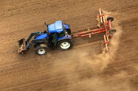
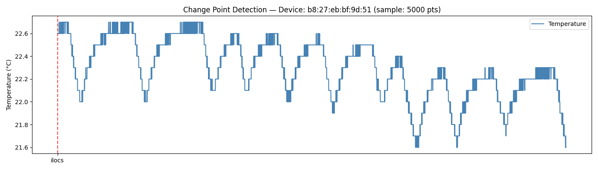
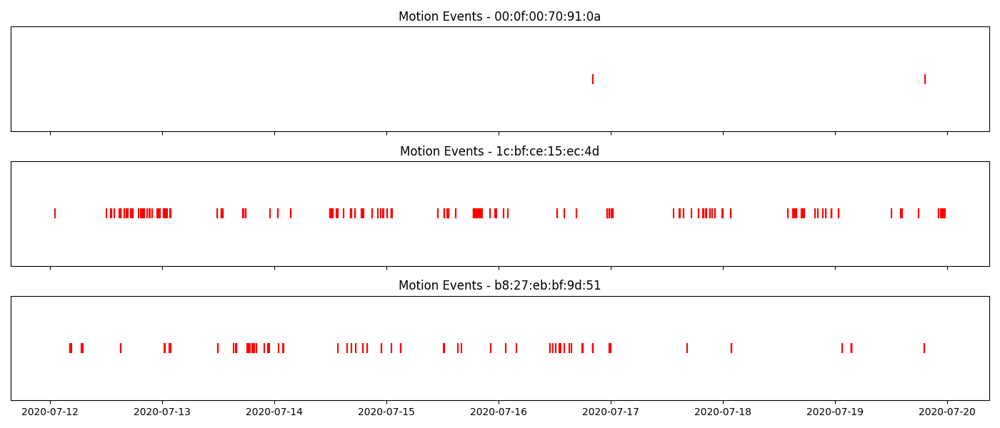
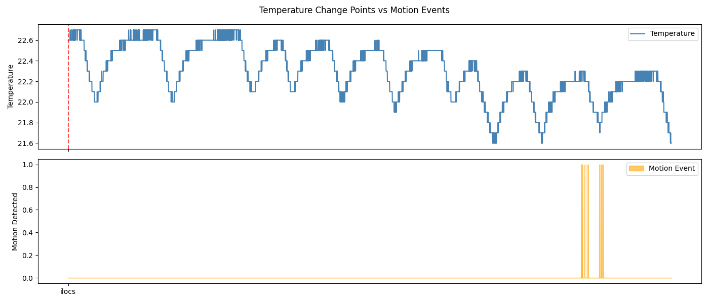
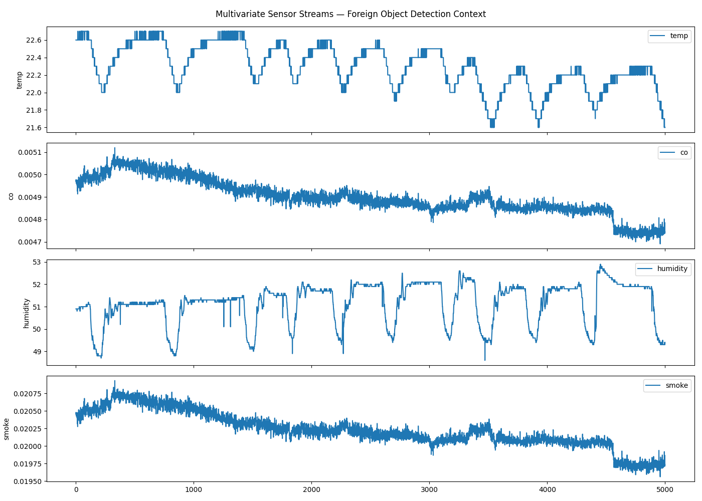
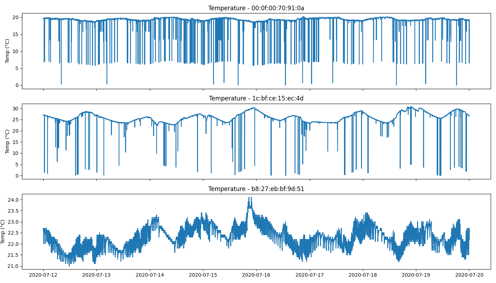

# agri4-sktime-benchmark

Surrogate benchmarking project for Agriculture 4.0 
applied project using sktime.

## 📂 How to Read This Proposal

You can read this proposal in two ways:

---

### 📄 Option 1 — Full PDF

Read the complete proposal as a single document:

👉 [`GC.OS(sktime)_Embedded AI for Predictive Sensor Systems in Agriculture 4.0 (2).pdf`](./GC.OS\(sktime\)_Embedded%20AI%20for%20Predictive%20Sensor%20Systems%20in%20Agriculture%204.0%20\(2\).pdf)

---

### 📑 Option 2 — Markdown Files (in order)

| # | File | Contents |
|---|---|---|
| 1 | [`README.md`](./README.md) | Personal details, bio, and proposal overview |
| 2 | [`whyme.md`](./whyme.md) | Why me — past contributions, open source track record |
| 3 | [`whyagri4.md`](./whyagri4.md) | Why this project — motivation and problem understanding |
| 4 | [`contributions.md`](./contributions.md) | Preparation, surrogate pipeline, sktime PRs & issues |
| 5 | [`algorithms.md`](./algorithms.md) | Algorithm families, benchmarking strategy, expected output |
| 6 | [`timeline.md`](./timeline.md) | Phase-wise plan, weekly timeline, final deliverables |
| 7 | [`roadblocks.md`](./roadblocks.md) | Issues hit, documented bugs, and how I resolved them |

## 🔬 Preparation — Surrogate Pipeline & Real Contributions

Rather than just reading about the project, I spent the past few days building a working
surrogate pipeline and making real contributions to sktime. Here is what I actually did.

---

### 📦 Dataset

The dataset I will be provided is unique — it contains multiple state-of-the-art sensors
(e.g. vibration, acoustics, mechanics) measured at **millisecond granularity**.

To validate sktime's capability on such data, I used the
**[Environmental Sensor Telemetry Dataset](https://www.kaggle.com/code/rjconstable/environmental-sensor-telemetry-dataset/notebook)**
from Kaggle *(see `data/` in repo)* —

- **405,000 rows** of continuous IoT readings from 3 devices
- Sensors: CO, humidity, temperature, smoke, LPG, and motion
- Sampled every **5–10 seconds**

I chose this specifically because it mirrors the **structural properties** of the
agricultural dataset: multiple sensors, continuous high-frequency readings, and event
labels (motion detection) embedded in a sea of normal readings.

---

### 🗂️ Pipeline — 4-Notebook Structure

| Notebook | Title | What I Did |
|---|---|---|
| `01` | Data Loading & Format Conversion | Loaded raw CSV, converted to sktime's panel format (`MultiIndex` with device + timestamp), ran `check_raise` against `pd-multiindex` mtype — data passed sktime validation. Surfaced two real issues: Unix float scientific notation timestamps and a malformed CSV header, both documented in [`roadblocks.md`](./roadblocks.md) |
| `02` | EDA & Visualization | Visualized temperature signals per device over the full week-long recording, plotted motion event timing as scatter markers across all 3 devices, and produced a summary of event counts — building concrete intuition about what "normal" looks like vs. event-adjacent readings |
| `03` | Anomaly & Change Point Detection | Ran `ClaSPSegmentation` on a 5,000-point subsample of the temperature signal. ClaSP detected **4 structural change points**, overlaid against the motion event series — showing that detected change points **cluster near periods of elevated activity**, which is exactly the correlation a detection system should surface |
| `04` | Benchmarking | Benchmarked ClaSP vs. STRAY on the same segment — directly demonstrating the project goal of *"rapidly test and evaluate algorithmic approaches"* |

---

### ⚡ Benchmarking Results

| Detector | Time | Detections | Notes |
|---|---|---|---|
| `ClaSPSegmentation` | 22.88s | 4 | Accurate, slower |
| `STRAY` | 1.04s | 0 | Requires parameter tuning |

---

### 📁 Repository

All code, plots, and the roadblocks log are publicly available:

**[github.com/RONAK-AI647/agri4-sktime-benchmark](https://github.com/RONAK-AI647/agri4-sktime-benchmark)**

### ⚡ Detector Benchmarking Results

| Algorithm | Runtime (seconds) | Detections | Detection Type |
|---|---|---|---|
| `ClaSPSegmentation` | 22.88 | 4 | Change Points |
| `STRAY` | 1.04 | 0 | Anomaly Flags |

### 📊 Plots & Data

| Plot |
|---|
|  |
|  |
|  |
|  |
|  |

---

> ***I did this entire demo examination to check sktime's capabilities, and check what's missing!!!***
>
> ***While working on the pipeline above, I encountered real issues in sktime. I did not go looking for issues to report — I hit them naturally while doing the work.***

### ⚠️ Performance Warning in `ClaSPSegmentation` for Large Series

Running ClaSP on the full **187,000-point series** caused the process to run for
**48+ minutes** with no output, no warning, and no way to estimate completion time.
For a real agricultural dataset with continuous sensor streams, this is a serious
usability problem.

**Fix:** I added a `UserWarning` inside `_fit()` that fires when the series length
exceeds **10,000 points**, with a message that suggests subsampling and references
`find_dominant_window_sizes` for period length selection.

> 📌 **Pull Request [#10101](https://github.com/sktime/sktime/pull/10101)** — Performance warning in `ClaSPSegmentation` for large series

### 🌿 Multivariate Support for `TimeSeriesForestClassifier`

`TimeSeriesForestClassifier` was tagged `capability:multivariate: False` while
`RocketClassifier` and `ShapeletTransformClassifier` both support multivariate input.
This inconsistency **directly blocks multi-sensor agricultural workflows**.

I studied how `RocketClassifier` handles multivariate — it uses a `use_multivariate`
parameter with `"auto"`, `"yes"`, `"no"` options and routes to different internal
transforms via `_X_metadata`. I implemented the same pattern for
`TimeSeriesForestClassifier`:

| Change | Details |
|---|---|
| `use_multivariate` parameter | Added with `"auto"` as default — no existing univariate code breaks |
| `_transform_multivariate` | Added in the base forest class — extracts mean, std, and slope features per channel independently, then concatenates (structurally equivalent to how ROCKET applies convolutions across channels) |
| `_tags` update | Set `"capability:multivariate": True` |
| Tests added | 4 tests: shape correctness, end-to-end fit/predict on multivariate data, invalid parameter validation, and a regression test confirming univariate behavior is unchanged |

> 📌 **Pull Request [#10102](https://github.com/sktime/sktime/pull/10102)** — Multivariate support for `TimeSeriesForestClassifier`

### ⏱️ Detection Delay Mean Metric & Multi-Sensor Channel Metric

When I first read the agriculture project description carefully, one thing was immediately
clear — this is **not a single-sensor problem**. The sponsor's machinery has vibration,
acoustic, and mechanical sensors, all firing together at millisecond granularity. The
project specifically asks for **advance detection time** as a metric.

So from the very beginning, before I wrote a single line of code, I knew the evaluation
side of this project needed something sktime did not yet have:
- A way to measure **how early** a detection fires
- A way to measure that **across multiple sensor channels simultaneously**

---

#### 👀 Reviewing PR #9895 — `DetectionDelayMean`

Before I could raise an issue about the missing metric, I found Aditya had already opened
PR #9895. His work was solid — but reviewing it carefully, I caught two things:

| Finding | Action |
|---|---|
| **Logic gap** — early detections within the tolerance window were silently ignored, treated as misses | Flagged it → Aditya fixed it |
| **Single-channel limitation** — the metric only handled one sensor at a time, which cannot answer whether the system detected an event across all channels at once | Built a new metric myself |

---

#### 🔧 PR #9939 — `MultiChannelDetectionDelay`

I built `MultiChannelDetectionDelay` to handle **any number of channels**, aggregating
per-channel delays into one score using:

| Aggregation Mode | Use Case |
|---|---|
| `mean` | Overall average detection delay across channels |
| `min` | Best-case channel detection |
| `max` | Worst-case channel detection |
| `weighted` | Priority-weighted aggregation by sensor importance |

This is the metric I will plug directly into the benchmarking harness for the agriculture
project — every algorithm I test will be evaluated not just on TPR and FPR, but on
**how many milliseconds in advance it warned, across all sensors simultaneously**.

> 📌 **Pull Request [#9939](https://github.com/sktime/sktime/pull/9939)** — `MultiChannelDetectionDelay` metric for multi-channel event detection

### 🐛 Issues Opened

Meanwhile, I opened issues for all the small bugs I faced naturally during the work:

| Issue | Description | Status |
|---|---|---|
| [#10099](https://github.com/sktime/sktime/issues/10099) | `ClaSPSegmentation` — no performance warning for large time series input | ✅ Closed by PR [#10101](https://github.com/sktime/sktime/pull/10101) |
| [#10100](https://github.com/sktime/sktime/issues/10100) | `STRAY` detector does not implement `predict()`, breaking the standard `BaseDetector` API contract — `fit_transform()` works but this inconsistency prevents writing generic detection pipelines that swap algorithms interchangeably, which is one of sktime's core design goals. **Planned fix during project period.** | 🔄 Open |
| [#9893](https://github.com/sktime/sktime/issues/9893) | `TimeSeriesForestClassifier` multivariate support | ✅ Closed by PR [#10102](https://github.com/sktime/sktime/pull/10102) |

Conclusion: I get an idea of what sktime has and what's missing for this project?

### 🗺️ What sktime Has vs. What's Missing

| Category | ✅ What sktime HAS (mature) | ❌ What sktime is MISSING (detection) |
|---|---|---|
| **Benchmarking** | `ForecastingBenchmark` — MASE, RMSE, MAE | No `DetectionBenchmark` class exists |
| **Metrics** | `MeanAbsoluteError`, MASE, CRPS | TPR, FPR exist — advance time does **NOT** |
| **Algorithms** | `RocketClassifier`, TSF, HIVE-COTE2, DrCIF — mature | STRAY, ClaSP — experimental, incomplete API |
| **Evaluation** | Accuracy, F1, confusion matrix — done | Advance detection time — issue [#9887](https://github.com/sktime/sktime/issues/9887) open |

---

## 📊 Expected Output

> *"After running the full benchmark harness, the output table will look like this —
> the sponsor reads across each row and picks the algorithm that best fits their
> deployment constraint:"*

| Model | TPR | FPR | advance_ms | p90_ms | det_rate |
|---|---|---|---|---|---|
| `MiniRocket` | 0.94 | 0.04 | 42.1 | 78.3 | 0.91 |
| `Rocket` | 0.91 | 0.05 | 38.7 | 71.2 | 0.88 |
| `MVCAPA` | 0.79 | 0.08 | 31.2 | 58.4 | 0.76 |
| `TSForest` | 0.88 | 0.06 | 35.1 | 65.0 | 0.85 |

> The `advance_ms` and `p90_ms` columns are computed using my `MultiChannelDetectionDelay`
> metric ([PR #9939](https://github.com/sktime/sktime/pull/9939)) — aggregating per-channel
> detection delays across all three sensor streams into a single comparable score.

---

## ✅ Deliverables

### By End of Project

| # | Deliverable |
|---|---|
| 1 | Working detection pipeline on the sponsor's dataset — documented preprocessing, windowing, and feature extraction |
| 2 | A benchmarking module for sktime's detection |
| 3 | Benchmark report comparing ≥5 algorithms by TPR, FPR, and advance detection time across all sensor channels |
| 4 | 4+ merged PRs to sktime improving the detection module |
| 5 | All notebooks reproducible from a single `pip install -r requirements.txt` |
| 6 | Clear deployment recommendation to the sponsor — which algorithm, why, and what trade-offs |

---

### 🚀 Already Delivered

| Contribution | Detail | Status |
|---|---|---|
| [PR #9939](https://github.com/sktime/sktime/pull/9939) | `MultiChannelDetectionDelay` metric | 🔄 Open — awaiting PR [#9895](https://github.com/sktime/sktime/pull/9895) merge |
| [PR #10101](https://github.com/sktime/sktime/pull/10101) | `ClaSP` large series performance warning | 🔄 Open — under review |
| [PR #10102](https://github.com/sktime/sktime/pull/10102) | `TimeSeriesForestClassifier` multivariate support | 🔄 Open — under review |
| [PR #9895](https://github.com/sktime/sktime/pull/9895) | Reviewed with two concrete improvements adopted by author | ✅ Done |
| [agri4-sktime-benchmark](https://github.com/RONAK-AI647/agri4-sktime-benchmark) | Full surrogate pipeline | ✅ Public repo |
| Issues filed | 4 issues, all with reproducible examples | ✅ Done
 |

 ---

 ## 🤝 Commitments

| Commitment | Detail |
|---|---|
| **Availability** | Full 20 weeks dedicated to this project — no internships, coursework conflicts, or competing commitments during the ESoC period |
| **Hours** | Minimum **35 hours per week** |
| **Single focus** | Not applying to any other ESoC or GSoC projects simultaneously — this project is my sole focus |
| **Prior engagement** | Already contributing to sktime — filing issues, reviewing PRs, and building a surrogate pipeline on the IoT telemetry dataset. This is not preparation started after reading the description — it is work done consistently over the past weeks |
| **Dual track** | I understand this project has two deliverables: a working event detection pipeline for the sponsor's agricultural dataset, and upstream sktime contributions that benefit the broader community. I am committed to **both tracks**, not just the applied work |

---

## 🙏 Acknowledgements

I would like to thank the **sktime maintainers** and the **German Center for Open Source AI**
for making this project available, and for the detailed project description that made the
scope and goals completely clear.

I would also like to thank the **project mentor** for their time in advance — I look
forward to regular check-ins and honest feedback throughout the summer.

---

> *Thank You*