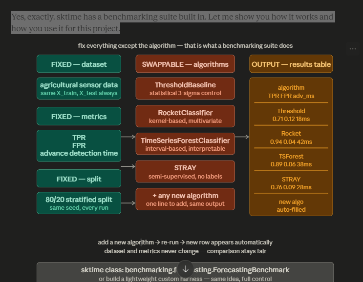

## 🤖 Algorithms & Benchmarking

sktime does not have a benchmarking suite for detection — and I was not certain about
which algorithms to use without seeing the dataset properly. So I decided to **contribute
a benchmarking suite for detection in sktime**, similar to the existing forecasting
benchmarking module.

This gives us a dedicated detection benchmarking module in sktime, and for the project,
we can fix the dataset and metrics then **swap algorithms freely** according to evaluation needs.



---

### 🗂️ Algorithm Families

---

#### Family 0 — `skchange`

`skchange` is built directly on top of sktime for changepoint and anomaly detection in
multivariate streams. It uses sktime's `BaseSeriesAnnotator` interface, plugging directly
into any sktime pipeline.

| Algorithm | Description |
|---|---|
| `MVCAPA` | Multivariate CAP Anomaly detector — trained only on normal data. At inference, tells us *when* an event occurred **and** which sensors triggered it (vibration, acoustic, or both). Covers the explainability stretch goal with no extra work. |
| `PELT` & `MOSUM` | Fast changepoint detectors, numba-accelerated, embedded-friendly |

---

#### Family 1 — Signal Processing + Classical ML

| Algorithm | Description |
|---|---|
| Wavelet (DWT) + XGBoost | Multi-resolution analysis, energy per sub-band as features, SHAP explainability built in |
| MFCC + SVM | Mel-frequency cepstral coefficients from acoustic channel, RBF kernel SVM |
| Hand-crafted features + XGBoost | Kurtosis, spectral entropy, cross-sensor correlation fed into gradient boosted trees |

---

#### Family 2 — sktime SOTA Classifiers

| Algorithm | Description |
|---|---|
| `HIVE-COTE 2` | Ensemble of DrCIF, Arsenal, STC, TDE — ranked #1 on UCR benchmark across 112 datasets |
| `DrCIF` | Diverse Representation Canonical Interval Forest — extracts 22 features per interval across multiple temporal resolutions |
| `InceptionTime` | Deep CNN ensemble, 5 Inception networks averaged, available via sktime wrapper |


---

#### Family 3 — Deep Learning

| Algorithm | Description |
|---|---|
| 1D CNN | Learns filters directly from raw waveform, no feature engineering needed (PyTorch or sktime wrapper) |
| CNN + LSTM hybrid | CNN extracts local patterns per window, LSTM captures temporal dependencies across windows |
| TCN | Temporal Convolutional Network — dilated causal convolutions, faster than LSTM, better suited for high-frequency sensor streams |

---

#### Family 4 — Semi-Supervised *(when labeled events are limited)*

| Algorithm | Description |
|---|---|
| Isolation Forest | No labels needed — isolates anomalies by random partitioning of feature space |
| One-Class SVM | Learns the boundary of normal operating conditions, flags anything outside |
| ROCKET + One-Class SVM | MiniRocket extracts 10,000 features from normal data, OC-SVM learns the normality boundary — catches novel event types never seen in training |

---

### ⭐ Preferred Algorithms

---

#### Algorithm 1 — Statistical Threshold

```python
# Train ONLY on normal windows
X_normal_features = X_features[y == 0]
mean = X_normal_features.mean(axis=0)
std  = X_normal_features.std(axis=0)

# Predict: flag anything more than 3 standard deviations from normal
def predict_threshold(X_test):
    z_scores = np.abs((X_test - mean) / (std + 1e-8))
    return (z_scores.max(axis=1) > 3).astype(int)
```

---

#### Algorithm 2 — `RocketClassifier` *(best accuracy)*

```python
from sktime.classification.kernel_based import RocketClassifier

rocket_clf = RocketClassifier(
    num_kernels=10000,
    use_multivariate="yes"   # our dataset is multivariate
)
rocket_clf.fit(X_train_sktime, y_train)
y_pred = rocket_clf.predict(X_test_sktime)
```

---

#### Algorithm 3 — `TimeSeriesForestClassifier`

```python
from sktime.classification.interval_based import TimeSeriesForestClassifier

tsf = TimeSeriesForestClassifier(
    n_estimators=200,
    use_multivariate="yes"   # enabled by my own PR #10102
)
tsf.fit(X_train_sktime, y_train)
y_pred = tsf.predict(X_test_sktime)
```

---

#### Algorithm 4 — `STRAY` Anomaly Detector *(semi-supervised, no labels needed)*

```python
from sktime.detection.stray import STRAY

# Train ONLY on normal data — no event labels needed
stray = STRAY(alpha=0.01, k=10)
stray.fit(X_normal_sktime)

# At inference: anomaly score for each window
anomaly_flags = stray.fit_transform(X_test_sktime)
```