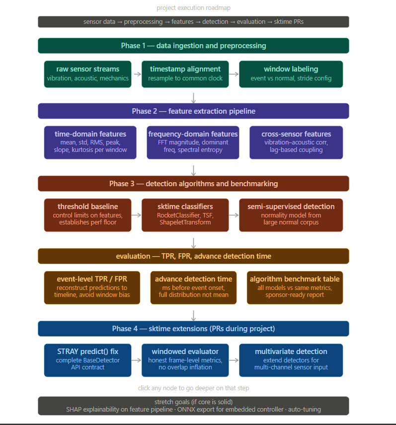

## Honest assessment of preparation work 

I want to be direct about something. The real dataset is going to be harder than my surrogate — more sensors, faster sampling, more subtle event signatures. I am not pretending my surrogate work is equivalent. What it proves is that I know how to set up the pipeline, I know where sktime's edges are, and I know how to contribute fixes when I hit them. That is the preparation I can offe

## What's my approach for the project ??

Firstly manipulate the data { we never know the dataset format}

### Step 1 — Data Manipulation
> *We never know the dataset format going in.*


I will extend this to a complete project pipeline: 


### 🏗️ Repository Architecture

```
agri4-sktime-benchmark/
│
├── data/
│   ├── raw/                          ← sensor CSV from manufacturer
│   └── processed/                    ← windowed numpy arrays
│
├── src/
│   └── agri4/
│       ├── __init__.py
│       │
│       ├── data/
│       │   ├── __init__.py
│       │   ├── loader.py             ← raw CSV → pandas MultiIndex
│       │   ├── windower.py           ← stream → (n_windows, n_sensors, length)
│       │   └── formatter.py          ← numpy → sktime nested DataFrame
│       │
│       ├── detection/
│       │   ├── __init__.py
│       │   ├── supervised.py         ← RocketClassifier, TSForest wrappers
│       │   ├── semisupervised.py     ← MVCAPA, STRAY wrappers
│       │   └── baseline.py           ← threshold, IsolationForest
│       │
│       ├── evaluation/
│       │   ├── __init__.py
│       │   ├── metrics.py            ← TPR, FPR, advance_detection_time()
│       │   └── benchmark.py          ← DetectionBenchmark class ← my sktime PR
│       │
│       └── pipeline.py               ← wires everything together
│
├── notebooks/
│   ├── 01_data_loading.ipynb
│   ├── 02_eda.ipynb
│   ├── 03_anomaly_detection.ipynb
│   └── 04_benchmarking.ipynb
│
├── sktime_contributions/
│   └── detection_benchmark.py        ← generalised, no agri-specific code
│
├── experiments/
│   └── results/
│       └── benchmark_results.csv
│
├── tests/
│   ├── test_loader.py
│   ├── test_metrics.py
│   └── test_benchmark.py
│
├── requirements.txt
├── README.md
└── roadblocks.md
```
This has three very important files: 

`src/agri4/data/loader.py` — this is the dataset integration with sktime: 

```
import pandas as pd
import numpy as np
from sktime.utils.data_container import from_3d_numpy_to_nested

class SensorDataLoader:
    """
    Loads raw sensor CSV and converts to sktime panel format.
    Works with surrogate IoT dataset now.
    Will work with real agricultural dataset unchanged.
    """
    def __init__(self, sensor_cols, label_col, window_size=50, stride=25):
        self.sensor_cols = sensor_cols
        self.label_col   = label_col
        self.window_size = window_size
        self.stride      = stride

    def load_raw(self, path):
        df = pd.read_csv(path,
            names=['ts','device','co','humidity',
                   'light','lpg','motion','smoke','temp'],
            skiprows=1)
        df['ts'] = pd.to_datetime(df['ts'].astype(float), unit='s')
        df = df.sort_values(['device','ts'])
        df = df.set_index(['device','ts'])
        return df

    def to_sktime_panel(self, df):
        """Core method — converts raw df to sktime nested DataFrame + labels"""
        windows, labels = [], []
        for device, group in df.groupby(level='device'):
            vals   = group[self.sensor_cols].values   # (n, n_sensors)
            lbls   = group[self.label_col].astype(int).values
            for i in range(0, len(vals)-self.window_size, self.stride):
                windows.append(vals[i:i+self.window_size].T)  # (n_sensors, wlen)
                labels.append(int(lbls[i:i+self.window_size].any()))

        X = np.array(windows)    # (n_windows, n_sensors, window_size)
        y = np.array(labels)
        return from_3d_numpy_to_nested(X), y  # ← sktime format


```

`src/agri4/evaluation/metrics.py` –the advanced metric detection pr after merging

```
import numpy as np

def advance_detection_time(y_pred, event_onsets, stride_ms=100):
    """
    Computes advance detection time distribution.
    This is missing from sktime 
    """
    advances = []
    for onset in event_onsets:
        onset_win = onset // stride_ms
        search    = y_pred[max(0, onset_win-50):onset_win]
        if search.sum() > 0:
            first = np.argmax(search > 0)
            advances.append((len(search) - first) * stride_ms)
    if not advances:
        return {"mean_ms": 0, "p90_ms": 0, "detection_rate": 0}
    return {
        "mean_ms":        round(float(np.mean(advances)), 1),
        "p90_ms":         round(float(np.percentile(advances, 90)), 1),
        "detection_rate": round(len(advances) / len(event_onsets), 3)
    }

```

`src/agri4/evaluation/benchmark.py` — my DetectionBenchmark prototype: 

```
import pandas as pd
from sklearn.metrics import recall_score, precision_score
from sklearn.model_selection import train_test_split

class DetectionBenchmark:
    """
    Prototype of what will become sktime's DetectionBenchmark.
    Fix dataset + metrics once. Swap algorithms freely.
    """
    def __init__(self, X, y, event_onsets=None, test_size=0.2):
        self.X_train, self.X_test, self.y_train, self.y_test = \
            train_test_split(X, y, test_size=test_size,
                             stratify=y, random_state=42)
        self.event_onsets = event_onsets
        self.results = []

    def run(self, name, model, supervised=True):
        if supervised:
            model.fit(self.X_train, self.y_train)
        else:
            model.fit(self.X_train[self.y_train == 0])  # normal only
        y_pred = model.predict(self.X_test)
        self.results.append({
            "algorithm": name,
            "TPR": round(recall_score(self.y_test, y_pred), 4),
            "FPR": round(1 - precision_score(self.y_test, y_pred,
                                              zero_division=0), 4),
        })
        print(f"  {name:30s} TPR={self.results[-1]['TPR']} "
              f"FPR={self.results[-1]['FPR']}")

    def report(self):
        return pd.DataFrame(self.results).sort_values("TPR", ascending=False)
```

### 📦 Clean Notebook Imports

Once the architecture is in place, notebook imports become simple and thin:

| Module | Import |
|---|---|
| Data Loading | `from agri4.data.loader import SensorDataLoader` |
| Benchmarking | `from agri4.evaluation.benchmark import DetectionBenchmark` |
| Algorithm | `from sktime.classification.kernel_based import RocketClassifier` |

---


---