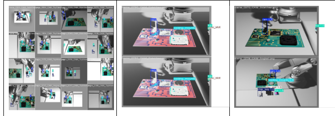
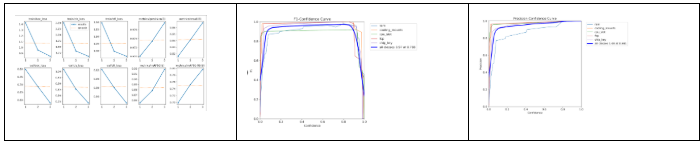
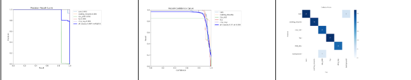
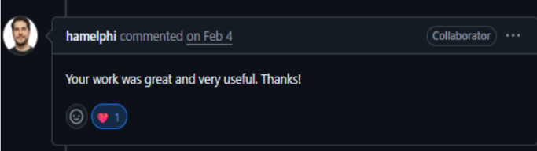
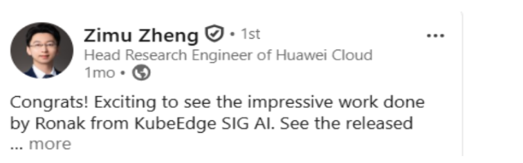

## 👤 Personal Details

| Field        | Details                                                                 |
|--------------|-------------------------------------------------------------------------|
| **Name**     | Ronak Raj                                                               |
| **Email**    | [codeitronak226277@gmail.com](mailto:codeitronak226277@gmail.com)       |
| **GitHub**   | [github.com/RONAK-AI647](https://github.com/RONAK-AI647)               |
| **LinkedIn** | [linkedin.com/in/ronak-r-a221a7386](https://www.linkedin.com/in/ronak-r-a221a7386/) |
| **Time Zone**| India (UTC+5:30)                                                        |
| **University**| BIT Sindri                                                             |
| **Degree**   | Bachelor of Technology                                                  |
| **Major**    | Artificial Intelligence and Material Sciences                           |
| **Hub**      | 🏢 German Center for Open Source AI                                     |

## 🧑‍💻 Introduction

### Brief Bio

I am an Artificial Intelligence Researcher, Software Developer, and an upcoming **KubeCon Speaker**
where I will present research on **Embodied Intelligence and Edge Computing architectures**,
showcasing advanced methodologies for integrating Vision-Language Models (VLMs) with
decentralized edge orchestration.

I am passionate about AI, LLMs, RAGs, and natural sciences. I love learning applied AI on
natural sciences and contributing to open source. I have contributed to open source for
**more than 3 years** and am a **top 10 contributor** in several major repositories:

| Repository | PRs | Focus Area |
|---|---|---|
| [google-deepmind/torax](https://github.com/google-deepmind/torax) | 3 PRs | Plasma research |
| [CNCF/KubeEdge](https://github.com/kubeedge/kubeedge) | 6 PRs | Embodied intelligence benchmarks & datasets |
| [langchain-ai/langchain-google](https://github.com/langchain-ai/langchain-google) | 10 PRs | GenAI, Vertex AI & Gemini API integrations |
| [Learning-Equality](https://github.com/learningequality) | 10 PRs | Multimodal features & streaming fixes |

## 💡 Why Me?

Because I deliver complex milestones on schedule, add innovation to my work, and maintain
proactive, transparent communication — demonstrated by my contributions below.

---

### 🏆 LFX Mentee — CNCF @ KubeEdge `[3500++ additions]`

Contributed to **KubeEdge/Ianvs**, a Distributed Synergy AI Benchmarking Suite. I created a
novel, industrial-grade dataset based on **Embodied AI (EAI)**, where a robotic arm assembles
components on a motherboard, and benchmarked it with Ianvs — achieving an accuracy of **64%**.

## 📸 Screenshots

**Innovation highlights:**
- Produced benchmarking results in clean, tabular formats for clarity and reproducibility
- Added `matplotlib` curves for in-depth performance analysis
- Designed the entire lab setup from scratch — the robot, motherboard, components, and
  environment — which impressed mentors and led to an invitation to integrate this work into
  the **core codebase of Ianvs**

| Detail | Info |
|---|---|
| **Language** | Python |
| **Algorithms** | YOLOv8, Force/Torque Sensors |
| **Skills** | PyTorch, Transformers, Benchmarking, PyBullet, Blender, Matplotlib, NumPy |

> *"The same skills — building a benchmarking suite, designing datasets, producing reproducible
> evaluation results — are exactly what this agriculture project requires."*

---

### 🔬 Top 10 Contributor — `google-deepmind/torax`

3 PRs merged · 14 commits · `219++ / 516--`

Contributed to Torax, a plasma physics simulation library by Google DeepMind.

| Detail | Info |
|---|---|
| **Skills** | JAX, Plasma Physics |

---

### 🔗 Top Contributor — `langchain-ai/langchain-google`

6 PRs merged across `genai` and `vertexai` packages — including Gemini API integrations,
multimodal features, and streaming fixes.

| Detail | Info |
|---|---|
| **Skills** | Gemini API, Vertex AI, GenAI |

---

### 🤝 Maintainers & Collaborations

- **Hamel Philippe** — Engineer, Google DeepMind
- **Zimu Zheng** — Head Research Engineer, Huawei Cloud

---

### 📚 What Did I Learn?

- Write quality, minimal, and targeted code in large codebases — one wrong change can break
  10 unit tests
- Use AI to **boost contributions**, not bloat the repo with unnecessary code